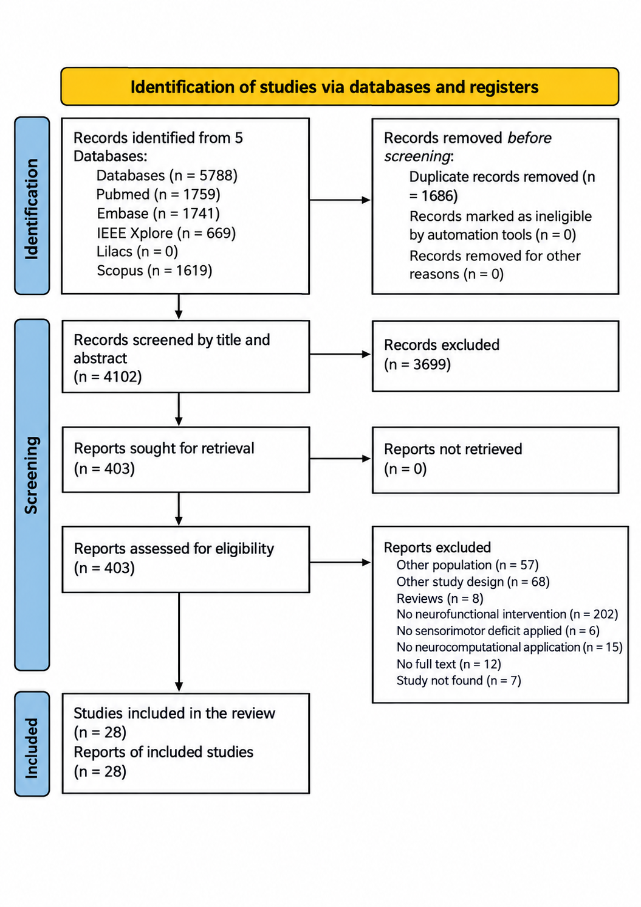

# Computational Neuroscience in Neurological Physiotherapy: A Scoping Review of AI Models and Neurorehabilitation Technologies
The study synthesizes the global landscape of neurotechnologies informed by computational neuroscience and applied to neurological physiotherapy, with emphasis on the technologies used, clinical outcomes, and translational challenges in neurorehabilitation.

The review included **28 studies published between 2015 and 2025**.
## Research Question
"What neurotechnologies informed by computational neuroscience have been applied in neurological physiotherapy and neurorehabilitation for individuals with sensorimotor deficits, what clinical outcomes have been reported, and what translational challenges limit their clinical implementation?"

## Methodology
A scoping review was conducted according to Joanna Briggs Institute recommendations and reported in accordance with the PRISMA-ScR guideline. 
Searches were performed in PubMed/MEDLINE, EMBASE, Scopus, and IEEE Xplore for studies published between 2015 and 2025. Primary studies involving individuals with neurological conditions and sensorimotor deficits were included when they applied computational neuroscience-based approaches within neurological physiotherapy or neurorehabilitation. 

## Search Strategy
The literature searches were conducted in the following databases:

- **PubMed/MEDLINE**
- **EMBASE**
- **Scopus**
- **IEEE Xplore**

Search strategies were formulated using a combination of controlled descriptors (MeSH and Emtree) and free-text terms related to the topic, applying the Boolean operators AND and OR. Terms were organized into two thematic blocks, the first pertaining to computational neuroscience and the second to neurological physiotherapy. Date filters were applied to restrict results to the period from January 1, 2015, to May 2, 2025. A manual search of the reference lists of included studies was also performed to identify additional potentially relevant publications

Below is the complete search string used in the databases:
- **Pubmed**
  
("Artificial Intelligence"[MeSHTerms] OR "Artificial Intelligence"[Title/Abstract] OR "Computer Reasoning"[Title/Abstract] OR "Machine Intelligence"[Title/Abstract] OR "Computational Intelligence" [Title/Abstract] OR "Computer Vision Systems"[Title/Abstract] OR "Computer Vision System"[Title/Abstract] OR "Knowledge Acquisition"[Title/Abstract] OR "Knowledge Representation"[Title/Abstract] OR "Machine Learning"[MeSHTerms] OR "Machine Learning"[Title/Abstract] OR "Transfer Learning"[Title/Abstract] OR "Neural Networks, Computer"[MeSHTerms] OR "Computer Neural Network"[Title/Abstract] OR "Neural Network Models"[Title/Abstract] OR "Connectionist Models"[Title/Abstract] OR "Perceptron"[Title/Abstract] OR "Computational Neural Networks"[Title/Abstract] OR "Neural Networks"[Title/Abstract] OR "Deep Learning"[Mesh] OR "Deep Learning"[Title/Abstract] OR "Hierarchical Learning"[Title/Abstract] OR "Computational Neuroscience"[Title/Abstract]) AND ("Neurological Rehabilitation"[MeSH Terms] OR "Neurologic Rehabilitation"[Title/Abstract] OR "Neurorehabilitation"[Title/Abstract] OR "Physiotherapy"[Title/Abstract] OR "Physical Therapy"[Title/Abstract] OR "Neurological Physiotherapy"[Title/Abstract] OR "Neurophysiotherapy"[Title/Abstract])

- **Embase**

(’artificial intelligence’/exp OR ’machine intelligence’:ab,ti OR ’machine learning’/exp OR ’learning machine’:ab,ti OR ’learning machines’:ab,ti OR ’deep learning’/exp OR ’deep machine learning’:ab,ti OR ’deep ml’:ab,ti OR ’hierarchical learning’:ab,ti OR ’deep learning’:ab,ti OR ’artificial neural network’/exp OR ’artificial neural networks’:ab,ti OR ’algorithmic neural network’:ab,ti OR ’ann’:ab,ti OR ’ann analysis’:ab,ti OR ’ann approach’:ab,ti OR ’ann method’:ab,ti OR ’ann methodology’:ab,ti OR ’ann methods’:ab,ti OR ’ann model’:ab,ti OR ’ann modeling’:ab,ti OR ’ann modelling’:ab,ti OR ’ann models’:ab,ti OR ’ann output’:ab,ti OR ’ann technique’:ab,ti OR ’ann techniques’:ab,ti OR ’ann training’:ab,ti OR ’artificial nn’:ab,ti OR ’artificial nns’:ab,ti OR ’computational neural network’:ab,ti OR ’computer neural network’:ab,ti OR ’computer neural networks’:ab,ti OR ’computerized neural network’:ab,ti OR ’connectionist model’:ab,ti OR ’connectionist network’:ab,ti OR ’connectionist neural network’:ab,ti OR ’connectionist system’:ab,ti OR ’mathematical neural network’:ab,ti OR ’neural network’:ab,ti OR artificial:ab,ti OR ’neural network’:ab,ti OR ’neural network algorithm’:ab,ti OR ’neural network model’:ab,ti OR ’neural networks’:ab,ti OR ’neural networks, computer’:ab,ti OR ’artificial neural network’:ab,ti OR ’theoretical neuroscience’/exp OR ’computation neuroscience’:ab,ti OR ’computational neuroscience’:ab,ti OR ’mathematical neuroscience’:ab,ti OR ’theoretical neuroscience’:ab,ti) AND (’physiotherapy’/exp OR ’physical therapy’:ab,ti OR ’physical therapy modalities’:ab,ti OR ’physical therapy service’:ab,ti OR ’physical therapy speciality’:ab,ti OR ’physical therapy specialty’:ab,ti OR ’physical therapy techniques’:ab,ti OR ’physical treatment’:ab,ti OR ’physiotherapy’:ab,ti OR ’physio therapy’:ab,ti OR ’physiotherapy department’:ab,ti OR ’therapy, physical’:ab,ti OR ’neurorehabilitation’/exp OR ’neurorehabilitation’:ab,ti OR ’neuro-rehabilitation’:ab,ti OR ’neurologic rehabilitation’:ab,ti OR ’neurological rehabilitation’:ab,ti)

- **IEEE Xplore**
  
("Artificial Intelligence" OR "Machine Intelligence" OR "Machine Learning" OR "Learning Machine" OR "Learning Machines" OR "Deep Learning" OR "Deep Machine Learning" OR "Deep ML" OR "Transfer Learning" OR "Hierarchical Learning" OR "Artificial Neural Network" OR "Artificial Neural Networks" OR "Algorithmic Neural Network" OR "Computational Neural Network" OR "Computational Neural Networks" OR "Computer Neural Network" OR "Computer Neural Networks" OR "Computerized Neural Network" OR "Artificial NN" OR "ANN" OR "ANN Analysis" OR "ANN Approach" OR "ANN Method" OR "ANN Methodology" OR "ANN Model" OR "ANN Modeling" OR "ANN Models" OR "ANN Technique" OR "ANN Training" OR "Connectionist Model" OR "Connectionist Models" OR "Connectionist Network" OR "Connectionist System" OR "Neural Network" OR "Neural Networks" OR "Neural Network Algorithm" OR "Neural Network Model" OR "Neural Network Models" OR "Perceptron" OR "Perceptrons" OR "Computer Reasoning" OR "Computational Intelligence" OR "Computer Vision System" OR "Computer Vision Systems" OR "Knowledge Acquisition" OR "Knowledge Representation" OR "Computational Neuroscience" OR "Computation Neuroscience" OR "Mathematical Neuroscience" OR "Theoretical Neuroscience") AND ("Physiotherapy" OR "Physio Therapy" OR "Physical Therapy" OR "Neurophysiotherapy" OR "Neurological Physiotherapy" OR "Neurorehabilitation" OR "Neuro-Rehabilitation" OR "Neurologic Rehabilitation" OR "Neurological Rehabilitation")

- **SCOPUS**
  
TITLE-ABS-KEY ( ( "Artificial Intelligence" OR "Machine Intelligence" OR "Machine Learning" OR "Learning Machine" OR "Learning Machines" OR "Deep Learning" OR "Deep Machine Learning" OR "Deep ML" OR "Transfer Learning" OR "Hierarchical Learning" OR "Artificial Neural Network" OR "Artificial Neural Networks" OR "Algorithmic Neural Network" OR "Computational Neural Network" OR "Computational Neural Networks" OR "Computer Neural Network" OR "Computer Neural Networks" OR "Computerized Neural Network" OR "Artificial NN" OR "ANN" OR "ANN Analysis" OR "ANN Approach" OR "ANN Method" OR "ANN Methodology" OR "ANN Model" OR "ANN Modeling" OR "ANN Models" OR "ANN Technique" OR "ANN Training" OR "Connectionist Model" OR "Connectionist Models" OR "Connectionist Network" OR "Connectionist System" OR "Neural Network" OR "Neural Networks" OR "Neural Network Algorithm" OR "Neural Network Model" OR "Neural Network Models" OR "Perceptron" OR "Perceptrons" OR "Computer Reasoning" OR "Computational Intelligence" OR "Computer Vision System" OR "Computer Vision Systems" OR "Knowledge Acquisition" OR "Knowledge Representation" OR "Computational Neuroscience" OR "Computation Neuroscience" OR "Mathematical Neuroscience" OR "Theoretical Neuroscience" ) AND ( "Physiotherapy" OR "Physio Therapy" OR "Physical Therapy" OR "Neurophysiotherapy" OR "Neurological Physiotherapy" OR "Neurorehabilitation" OR "Neuro-Rehabilitation" OR "Neurologic Rehabilitation" OR "Neurological Rehabilitation" ) ) AND PUBYEAR > 2014 AND PUBYEAR < 2026

## Data Extraction
Data extraction was performed by two pairs of reviewers working independently and in a blinded manner. Any disagreements between reviewers were resolved by consensus and, when necessary, with the involvement of a third reviewer. This stage was carried out using a pre-designed, standardized, and reviewer-validated form in Microsoft Office Excel®.

The spreadsheets used for data organization and extraction are available in:
→ [Data Extraction Spreadsheet](data/data_extraction.xlsx)

## PRISMA-ScR Flow Diagram
The flow diagram describing the study identification, screening, eligibility, and inclusion process:

